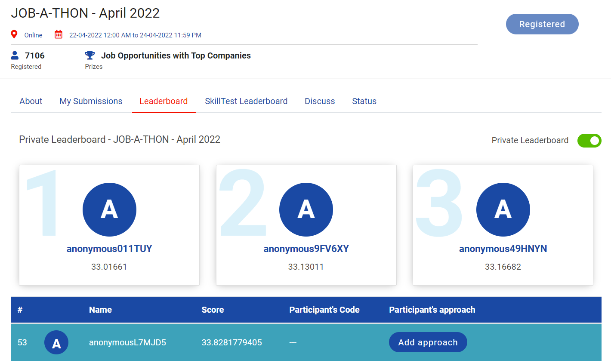

# Analytics-Vidhya-Jobathon-April-2022

The largest Data Science Hiring Event is Back!
And this event is your one shot at scoring your dream job.

Analytics Vidhya presents “JOB-A-THON” - India's Largest Data Science Hiring Event, where 1600+ of candidates have interviewed for over 65+ companies. You could be among them too! 

At JOB-A-THON every enthusiast will get the opportunity to showcase their skills and get a chance to interview with top companies for leading job roles in Data Science, Machine Learning & Analytics. 

**RANK:** 53 out of 7106

**SCORE:** 33.8281779405

## Problem Statement:
ABC is a car rental company based out of Bangalore. It rents cars for both in and out stations at affordable prices. The users can rent different types of cars like Sedans, Hatchbacks, SUVs and MUVs, Minivans and so on.

In recent times, the demand for cars is on the rise. As a result, the company would like to tackle the problem of supply and demand. The ultimate goal of the company is to strike the balance between the supply and demand in order to meet the user expectations.

The company has collected the details of each rental. Based on the past data, the company would like to forecast the demand of car rentals on an hourly basis.

The main objective of the problem is to develop the machine learning approach to forecast the demand of car rentals on an hourly basis.

## Acknowledgements:
https://datahack.analyticsvidhya.com/contest/job-a-thon-april-2022/

## Data Dictionary:
| **Variable** | **Description** |
| --- | --- |
| date | Date (yyyy-mm-dd) |
| hour | Hour of the day |
| demand | No. of car rentals in a hour |

## Evaluation Metric:
The evaluation metric for this hackathon is RMSE score.
